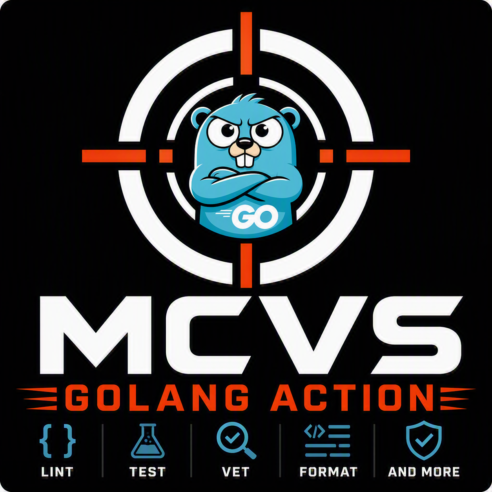

# MCVS Golang Action

[](https://github.com/schubergphilis/mcvs-golang-action/releases)
[](LICENSE)

</a>

The Mission Critical Vulnerability Scanner (MCVS) Golang Action repository is a
collection of standardized tools to ensure a certain level of quality of a
project with Go code.

## Github Action

The [GitHub Action](https://github.com/features/actions) in this repository
consists of the following steps:

- Install the Golang version that is defined in the project `go.mod`.
- Verify to be downloaded Golang modules.
- Check for incorrect import order and indicate how to resolve it.
- Code security scanning and suppression of certain CVEs for a maximum of one
  month. In some situations a particular CVE will be resolved in a couple of
  weeks and this allows the developer to continue in a safe way while knowing
  that the pipeline will fail again if the issue has not been resolved in a
  couple of weeks.
- Linting.
- Unit tests.
- Integration tests.
- Code coverage.
- A test summary, including the number of tests that have been run per testing
  type, using [gotestsum](https://github.com/gotestyourself/gotestsum).

In summary, using this action will ensure that Golang code meets certain
standards before it will be deployed to production as the assembly line will
fail if an issue arises.

Note: there is an [internal action](.github/workflows/package-version-updater.yml)
that will update package versions that cannot be updated by Dependabot.

## Versioning

This action follows semantic versioning. When using this action in your workflows:

- **Latest stable version**: Use the latest `v3.x.x` tag (e.g., `v3.12.12`) for production workflows
- **Major version tracking**: Use `@v3` to automatically get the latest v3.x.x updates
- **Taskfile references**: When including the remote Taskfile, use a specific version tag (e.g., `v3.12.12`) that matches your needs
- **Breaking changes**: Major version bumps (v3 → v4) may introduce breaking changes and require workflow updates

Check the [releases page](https://github.com/schubergphilis/mcvs-golang-action/releases) for the latest version and changelog.

## Taskfile

Another tool is configuration for [Task](https://taskfile.dev/). This repository
offers a `./build/task.yml` which contains standard tasks, like installing and
running a linter.

This `./build/task.yml` can then be used by other projects. This has the
advantage that you do not need to copy and paste Makefile snippets from one
project to another. As a consequence each project using this `./build/task.yml`
immediately benefits from improvements made here (e.g. new tasks or
improvements in the tasks).

If you are new to Task, you may want to check out the following resources:

- [Installation instructions](https://taskfile.dev/installation/)
- Instructions to [configure completions](https://taskfile.dev/installation/#setup-completions)
- [Integrations](https://taskfile.dev/integrations/) with e.g. Visual Studio Code, Sublime and IntelliJ.

## Usage

### Locally

Create a `Taskfile.yml` with the following content:

```yml
---
version: 3

vars:
  REMOTE_URL: https://raw.githubusercontent.com
  REMOTE_URL_REF: v3.12.12
  REMOTE_URL_REPO: schubergphilis/mcvs-golang-action

includes:
  remote: >-
    {{.REMOTE_URL}}/{{.REMOTE_URL_REPO}}/{{.REMOTE_URL_REF}}/build/task.yml
```

and run one of the most common tasks:

```zsh
task remote:test --yes
task remote:test-integration --yes
task remote:lint --yes
task remote:coverage --yes
task remote:osv-scanner --yes
```

You can use `task --list-all` to get a list of all available tasks.
Alternatively, if you have [configured
completions](https://taskfile.dev/installation/#setup-completions) in your
shell, you can tab to get a list of available tasks.

### GitHub

#### Basic Example

For a simple project that needs standard testing and linting, create a `.github/workflows/golang.yml` file:

```yml
---
name: Golang
"on": pull_request
permissions:
  contents: read
  packages: read
jobs:
  MCVS-golang-action:
    strategy:
      matrix:
        args:
          - testing-type: "unit"
          - testing-type: "lint"
          - testing-type: "coverage"
          - testing-type: "security-golang-modules"
    runs-on: ubuntu-24.04
    steps:
      - uses: actions/checkout@v4.1.1
      - uses: schubergphilis/mcvs-golang-action@v3
        with:
          testing-type: ${{ matrix.args.testing-type }}
          token: ${{ secrets.GITHUB_TOKEN }}
```

This basic configuration will run unit tests, linting, code coverage checks, and security scanning on your Go code.

## Documentation

- [Action inputs](docs/action-inputs.md): advanced workflow example and all
  inputs of the GitHub Action.
- [Taskfile variables](docs/taskfile-variables.md): variables that can be
  overridden when including the Taskfile.
- [Build tags](docs/build-tags.md): integration, component and e2e tests.
- [Linting](docs/linting.md): automatically fixing linting issues.
- [Releases](docs/releases.md): building binaries as release assets.
- [osv-scanner](docs/osv-scanner.md): security scanning and temporarily
  ignoring vulnerabilities.
